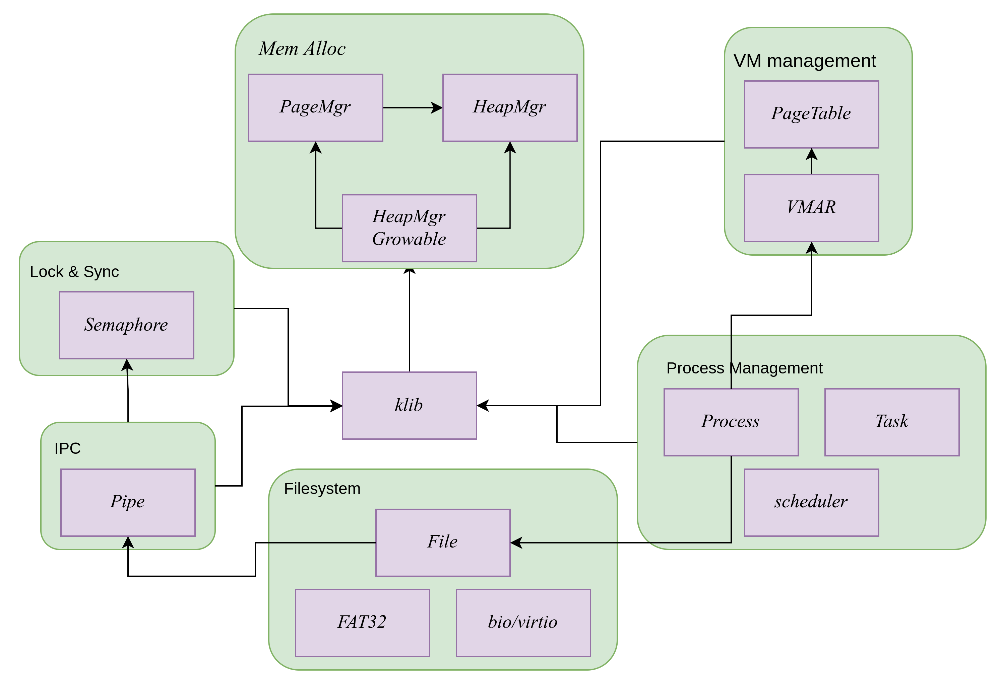

# LuoOS

## (LuoOS Utilizes Opensource Operating Systems)

队名：AA5555AA

学校：武汉大学

成员：钟祎诚 谭君宇

指导教师：蔡朝晖

[TOC]

## 功能及运行

我们的操作系统目前主要支持的功能为通过装载FAT32磁盘映像文件运行其中的用户程序。用户可以修改user/init.cc源程序后在项目根目录下运行make run命令，这将编译生成all目标——kernel-qemu内核可执行文件，并自动调用如下qemu命令运行操作系统：
```c
qemu-system-riscv64 -machine virt -kernel kernel-qemu -m 128M -nographic -smp 2 -bios default -drive file=fat32.img,if=none,format=raw,id=x0  -device virtio-blk-device,drive=x0,bus=virtio-mmio-bus.0
```
进一步的使用可参考user目录下的文档。

受限于项目实际开展的时间，这个系统的许多系统调用实现尚不完全，或不完备。初赛阶段要求的以下系统调用已全部支持（但部分不常用功能的行为尚不完整）：
```c
long SYS_getcwd(char *buf, size_t size);
int SYS_pipe2(int fd[], 0);
int SYS_dup(int fd);
int SYS_dup3(int old, int new, 0);
int SYS_chdir(const char *path);
int SYS_openat(int fd, const char *filename, int flags, mode_t mode);
int SYS_close(int fd);
int SYS_getdents64(int fd, struct dirent *buf, size_t len);
size_t SYS_read(int fd, void *buf, size_t count);
size_t SYS_write(int fd, const void *buf, size_t count);
int SYS_linkat(int olddirfd, char *oldpath, int newdirfd, char *newpath, int flags);
int SYS_mkdirat(int dirfd, const char *path, mode_t mode);
int SYS_umount2(const char *special, int flags);
int SYS_mount(const char *special, const char *dir, const char *fstype, int flags, const void *data);
int SYS_fstat(int fd, struct kstat *kst);
pid_t SYS_clone(int flags, 0, ptid, pid_t tls, pid_t ctid);
int SYS_execve(const char *path, char *const argv[], char *const envp[]);
pid_t SYS_wait4(pid_t pid, int *status, int options);
pid_t SYS_getppid();
pid_t SYS_getpid();
uintptr_t SYS_brk(uintptr_t brk);
int SYS_munmap(void *start, size_t len);
long SYS_mmap(void *start, size_t len, int prot, int flags, int fd, int off);
clock_t SYS_times(struct tms *tms);
int SYS_uname(struct utsname *uts);
int SYS_sched_yield();
int SYS_gettimeofday(struct timespec *ts, 0);
int SYS_nanosleep(const struct timespec *req, struct timespec *rem);
```

## 设计理念

本次参赛的操作系统由参赛队员的操作系统课设项目持续演进而来，具有如下设计理念。

### 从零开始循序渐进扩充系统功能

现有的操作系统实验众多，但大多是提供了整体框架只留存部分子模块以供实现，而未体现架构设计上的取舍。从零开始实现一个操作系统，我们经历了众多架构上的踩坑和调整，在不同阶段参考了不同的系统设计，由此了解到不同架构的考量。

从零实现系统能够对系统各功能间的依赖有更多的认识，我们的整体路线图遵循先实现运行环境后扩充功能、先实现功能运行后优化性能、封装解耦接口提前考虑重构的原则。初期我们参考软件所RVOS课程实现了M-mode与S-mode的异常与中断，随后参考u-core、xv6和浙江大学OS Lab实现了虚拟内存的管理和简易的用户态进程，支持Linux系统调用的过程中我们又参考Zircon、z-core和Linux修正了内存与进程部分的诸多设计，后续开发中我们也将更多的参考Zircon系与Linux内核的设计。

### 利用现代编程语言简化代码

在开发语言的选型阶段，我们一开始就排除了纯C语言，而是决定采用现代高级语言开发，有如下原因：

- 现代语言能提供更高层次的抽象与更丰富的语义，如`constexpr`、`namespace`、`bitfield`等很适于建模各类控制寄存器和状态属性，避免了C语言所写系统中处处是宏的低可读性，命名空间也使得符号命名更为简洁清晰。
- 现代语言能提供更好的面向对象支持，如STL的数据结构封装、Zircon内核一切皆是内核对象的封装，继承及模板也避免了C语言所写系统中处处是链表节点的冗杂。
- 现代语言能提供更好的资源管理和错误处理特性，如引用语义、RAII、智能指针都有助于减少系统编写中手动管理内存带来的错误。

而在rust与C++中我们最终选择了C++，因为两位同学此前并不具有Rust的开发经验，而内核设计赛时间紧任务重，因此选择了较为熟悉的C++语言。但在后续的开发过程中，我们逐渐意识到Rust语言的一些优势，包括但不限于：

- 标准库设计优良。Rust语言的标准库具有良好的依赖分层，在bare-metal层可使用no_std，在定义了allocator和default allocator之后则可直接使用标准库中的collections；而C++则直到C++23才能有较为可用的freestanding子集，标准库也与系统libc耦合，难以复用，因而我们有许多精力都耗费在重新实现类STL的数据结构、寻找与移植合适的tinySTL上。
- 周边生态丰富。系统分享会中我们才发现，Rust社区具有许多优秀的crates能大大简化OS实现，如virtio、sbi-runtime等。不过自行移植/实现这一部分也使得我们对各项功能有了更多的认识。

最后，我们的项目中尽量避免编写汇编，而是采用宏（`csrRead/Write/Set/Clear`, `ExecInst`）、属性标准`__attribute((naked))__` 等提高可读性。

### 复用开源基础设施

操作系统虽然相对而言较为耦合，但也有许多部分是非常模块化的，且这些部分往往本身实现起来具有较大的工作量。因此我们利用了许多开源基础设施，以简化我们的工作。目前具体有如下三方面：

- 内存分配：我们从OpenHarmony系统中了解到TLSF(Two-Level Segeregated Fit)算法是一种实时性高（O(1)复杂度）、性能优秀的堆内存分配算法，因此决定采用该种算法。搜索开源社区后发现其实现复杂度极高（动辄800行），但也高度模块化，因此比较后采用了[OlegHahm/tlsf](https://github.com/OlegHahm/tlsf)项目，外加上层的封装作为内核的堆内存分配器。
- 数据结构：C++使用数据结构必然采用类STL的实现，由于标准STL无法使用而其编写难度高，我们评估了许多项目后最终采用了[mendsley/tinystl](https://github.com/mendsley/tinystl)。但其只提供了很少的一部分数据结构，后期可能再移植其他更完整的STL实现。
- 文件系统：文件系统部分代码量较大，受制于工期我们目前移植适配了去年获奖队伍[能run就行队]()和xv6的实现（包括fat/bio/部分virtio），而采用C++的重构与精简则正在与VFS一道进行。

## 具体设计

在这一章节，我们首先描述内核运行环境的设计和取舍，再从功能划分的角度概述各模块设计，模块的实现细节在[docs](./docs)子目录中。

### 运行环境

相较于大型应用软件，操作系统内核的难度很大程度上在于在其运行环境的复杂多变，主要体现在三个方面：

- 执行流程：从嵌入式到高性能，trap是操作系统最基础的特性，而这也使得系统的执行流程变得非线性。
- 内存环境：内存环境的复杂性主要体现于进出中断时的切换，和用户态与内核态间的数据传输。
- 并发：区域赛阶段我们尚未实现并行运行，但在设计中充分考虑了对扩展至SMP的支持。具体的，我们将内核几乎所有的全局对象封装至`kGlobObjs`与`kHartObjs`，分别为多核全局的（如内存分配、内核信息、内核日志等）和各核心局部的（主要是当前核心绑定线程及其所依赖的结构），支持SMP时通过运算符重载对其进行加锁以简化代码。此外，我们在trapframe中保存有当前核心的hartid以用于局部资源的辨识。

以下分别从执行流程和内存环境的角度介绍设计。

#### 执行流程

内核的执行流大致有如下四种：

1. 初始化，为避免内核态重入的复杂性，该阶段我们设计为线性执行到底，初始化结束后再开启中断。

2. 用户态发起系统调用，该类执行过程实际上是用户态线程的延续，通常线性执行，但有部分例外：

   - yield或导致优先级抢占的系统调用：抢占是通过写`sip::stip`主动触发时钟中断达成，而yield则是通过一段特殊的代码实现。两者都会将上下文保存在`KContext`中，后续从中恢复上下文继续执行，实现在该内核线程视角的透明性。

   在该类内核线程的视角，所有系统调用的执行均从`uecallHandler`开始和退出。

3. 中断处理，中期我们曾支持过内核态的时钟中断抢占，但在后续优化virtio性能时遇到了难以定位的上下文混乱。考虑到现阶段主要目标并非性能优化，我们将其改回了：

   - 用户态开启时钟与外部中断；
   - 内核态只在virtio驱动中开启外部中断，在kIdle内核线程中开启外部和时钟中断以实现抢占，在用户线程对应的内核线程执行中关闭中断。

4. 纯内核线程，目前实现了kIdle线程，后续计划将日志输出等作为内核worker实现。该类线程主体均为一个事件循环，永远在内核态执行，因而其必须支持内核态的时钟中断。

由这四种内核执行流，我们需要具有如下三类执行栈：

1. 用户栈
2. 内核栈：为支持内核态的执行流切换，我们为每个用户线程分配了独立的内核栈。
3. 中断栈：考虑到兼容性，目前我们的异常处理采用了`Direct vector mode`即单入口，每次的执行栈都需动态获取。我们不能预知下次进入内核是由于中断还是异常，因此采用如下约定：
   * 当Hart在用户态执行，使用当前用户线程的内核栈作为中断栈；
   * 当Hart在内核态执行，使用分配给每个Hart的独立中断栈。

#### 内存环境

内核视角下的内存环境通常有两种选择：shared address space与dedicated kernel space（引述自[The Linux Kernel  documentation](#The Linux Kernel  documentation)）。权衡安全性、性能、实现复杂性后，我们采用了专有内核空间的设计，即所有内核线程共享一个内核地址空间、内核地址空间与用户地址空间可重叠。在陷入的入口处，我们将`satp`切换为内核页表，在出口切换回用户页表。

该种设计需要trampoline，现阶段我们是将整个内核的代码段与静态数据段映射至进程地址空间，将每个进程的trapframe映射至其地址空间，后续可通过链接脚本和`__attribute((section))__`将所用到的部分剥离出来。

目前内核内存空间采用线性映射，布局如下：

```lua
------------------- 0x0
device mmio
------------------- 0x40000000
opensbi
------------------- 0x80200000
kernel text
............ 
kernel data
............
kernel trap stacks
............
kernel bss
.......
uimg (init.elf二进制拷贝)
------------------- kernel_end / _frames_start
frames
------------------- physical frames end
```

用户进程内存空间布局如下：

```
------------------- 0x0
user elf specify
-------------------0x7fffff000
default user stack
------------------- 0x80200000
kernel text
............ 
kernel data
............
user task trapframe（暂时放这儿）
............
kernel bss
------------------- kernel_end
------------------- 0x83000000
for user use
```

其中用户进程的初始栈地址由内核指定，其后用户进程或线程可自行申请空间改变位置；用户堆的起始地址目前采用静态指定，后续需换为根据用户程序的data段设定；trapframe在用户空间的映射目前采用Hart的中断栈区域，后续需与精简后的trampoline放在一起。

### 功能模块

各功能模块间依赖关系如下，系统各模块的初始化即按照依赖顺序进行



#### 内存分配

内存分配又分为页帧分配器与内核堆分配器，二者现阶段均为内核全局唯一的对象。

前者由 `PageMgr` 实现，采用了伙伴算法，算法的实现使用数组下标表示节点关系。

后者由 `HeapMgr` 实现，又分为不可扩充的内核堆与可扩充的内核堆 `HeapMgrGrowable` ，其内部均采用TLSF算法的第三方开源实现。不可扩充内核堆主要用于 `PageMgr` 初始化前的内核内存管理，其使用静态分配的 `pool` 作为唯一的内存池，页帧分配器从中申请得到伙伴系统所使用的内存区段。可扩充内核堆主要是在当前内存池中分配失败时，向页帧分配器请求一定数量的页作为新内存池并记录于链表中。

内核首先使用placement new初始化不可扩充内核堆，在页帧分配器初始化完成后，内核会用它与页帧分配器初始化可扩充的内核堆分配器，即将静态`pool`的所有权转移至新分配器。

#### 内存管理

内存管理部分参考了Zircon的设计，主要由三个类完成：

* `PageTable` 类封装了Sv39模式下的页表操作，包括创建映射、删除映射、虚实地址转换等。为提高效率（如内核空间线性映射了 `0x0-0x40000000` 的MMIO设备区间），我们支持了根据对齐情况自动使用不同的页大小。
* `VMO` 类代表一个物理内存区段，并具有克隆类型等属性。
* `VMAR` 类是外部操作进程地址空间的接口，其具有创建虚拟地址到VMO的映射、删除映射、进程地址空间读写、映射区段查找等接口。zircon的VMAR支持树状层级结构，而我们的实现中暂未有这种需求，因此采用了扁平化的结构，各虚地址空间之间互不重叠。

内核启动时会创建内核页表，其所需的内核内存布局信息通过链接脚本创建的外部变量传递，由` initInfo()` 获取并存储在全局对象 `kInfo.segments` 中。由于实现中的历史原因，内核页表根节点是静态分配的。

#### 进程线程

为了更好的划分进程和线程的资源管理与运行环境功能，我们分别定义了 `Process` 与 `Task` 。为了封装这种由一个ID进行索引的结构，二者继承自 `IdManagable`。为了未来扩展进程线程两级调度，二者都继承自调度信息单元 `Schedulable`。

进程中封装有当前进程的地址空间管理对象`vmar`、文件打开表 `files` 和当前进程的子线程 `tasks` 等。

线程中封装有用户态上下文`Context ctx`和内核态上下文`kctx`，其中`kctx`额外存有当前线程的内核栈位置（内核空间地址）等。线程中还存有当前线程目前所处的优先级 `lastpriv` ，以供任务切换时进入正确的优先级。

调度器目前为全局唯一对象，采用优先级+时间片轮转的抢占式调度。优先级目前主要为kIdle线程服务，当优先级更高的线程进入就绪队列，调度器将主动触发一次时钟中断抢占kIdle线程以提高运行效率。

#### 中断处理

中断处理的设置主要分为两部分，外部中断初始化与CSR设置。

外部中断又分为各设备的初始化与PLIC初始化。内核启动时由每个Hart初始化各自的PLIC，外部设备的初始化仅由主核进行。目前该部分主要使用了[platform.hh](include/platform.hh)中的定义，使用结构体等建模了各控制寄存器以提高可读性。

CSR设置参照[执行流程](#执行流程)部分的行为。此外还需注意的是中断处理部分的原子性，例如改变外部设备设置前需关闭中断或PLIC、退出中断处理程序时必须使用`sret`结合`sstatus::spp`等。

#### 文件系统

文件系统方面，整体采用了经典的 `file object -> specific filesystem ` 结构。其中进程所持有的fd目前采用指向`File`对象的共享指针以实现资源管理，`File` 对象通过 `FileType` 标识其所管理的是管道、设备还是文件。
FAT文件系统部分现阶段沿用了xv6风格的架构，参考了22年队伍“能run就行”队，硬件驱动移植了xv6的virtio_disk实现。该实现使用qemu的virtio-blk将img映像文件作为操作系统根目录，而由于该实现在读写硬盘中调用了进程函数sleep()，因此文件系统的初始化必须在用户或系统线程环境下进行。内核将在初始化后的第一个用户进程中通过一个专用的系统调用对根文件系统进行初始化。受限于工作量，目前仅支持fat32文件系统，正在按照vfs架构重构。详细实现参见[docs/文件系统](docs/文件系统.md)。

#### 同步

目前实现了简易的信号量 `Semaphore` 以支持多处的同步，包括管道采用信号量实现经典的生产者-消费者同步、块设备缓冲采用信号量实现缓冲块资源的管理等。

#### 辅助功能

##### 内核库

内核库包含了内核功能无关的数据结构与函数，主要为标准C库、STL子集和我们扩充的部分。其中标准C库参考了Linux内核项目中nolibc的实现。STL子集参考Fuchsia的fbl及其C++使用规范，引入了部分无运行时依赖的标准STL实现，包括`<atomic> <type_traits>`等，定义在[include/safestl.hh](include/safestl.hh)中；以及引入了部分第三方的tinySTL实现。扩充部分主要是用于打印到`string`的`format`函数、环形缓冲区和链表等数据结构及智能指针。

##### 内核日志

Logging对于调试是必不可少的，然而由于缺乏STL我们很难移植现有的日志库。最早我们通过`DBG`宏开关与`printf`简单实现日志打印，但随着模块增加单级日志难以控制，因此改为`moduleLevel`（定义于每个文件控制该文件中输出门限）结合`outputLevel`（控制全局输出门限）的多级日志。当我们实现了区域赛大部分syscall时，出现了一些时间相关的上下文切换bug，若打印至uart会导致日志越详细运行越慢，难以复现bug。因此我们目前实现了将日志打印至内存中的`ringbuf` ，断点时查看全局的`kLogger`对象即可查看当前日志。此外，bug往往在运行很长一段时间后才出现，因此我们将原有的`outputLevel`宏改为全局变量以供动态调整。

## 路线图


## 参考资料

### RISCV标准

- The RISC-V Instruction Set Manual, Volume II: Privileged Architecture, Version 1.10”, Editors Andrew Waterman and Krste Asanovi´c, RISC-V Foundation, May 2017
- 《RISC-V SBI specification》. Makefile. 2018. Reprint, RISC-V Non-ISA Specifications. https://github.com/riscv-non-isa/riscv-sbi-doc.

### OS及实验

- [ISCAS-RVOS](https://gitee.com/unicornx/riscv-operating-system-mooc)
- [操作系统Lab - 知乎专栏](https://www.zhihu.com/column/c_1464733712995184640)
- [Zircon Kernel objects  | Fuchsia](https://fuchsia.dev/fuchsia-src/reference/kernel_objects/objects)
- [GitHub - rcore-os/zCore-Tutorial: Tutorial for zCore kernel.](https://github.com/rcore-os/zCore-Tutorial)
- [Introduction — The Linux Kernel  documentation](https://linux-kernel-labs.github.io/refs/heads/master/lectures/intro.html)
- The Design and Implementation of the FreeBSD Operating System by Marshall Kirk McKusick, George V. Neville-Neil, Robert N.M. Watson
- [GitHub - mit-pdos/xv6-riscv: Xv6 for RISC-V](https://github.com/mit-pdos/xv6-riscv)
- [OSKernel2023-NutOS](https://gitlab.eduxiji.net/202314430101195/oskernel2023-nutos)

### 工具及辅助设施

- [RISC-V: A Baremetal Introduction using C++.](https://www.shincbm.com/embedded/2021/05/03/riscv-and-modern-c++-part1-4.html)
- [five-embeddev](http://five-embeddev.com/)
- [Yale CPSC422/522 lab tools guide](https://flint.cs.yale.edu/cs422/labguide/index.html)
- Microsoft New Bing